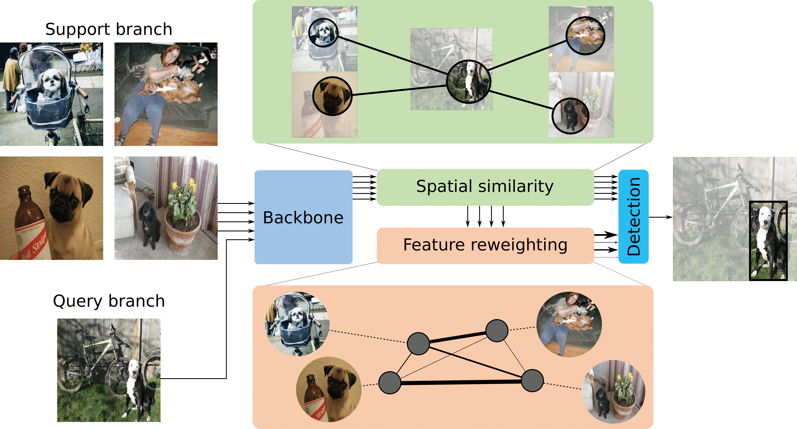

# The official code of "SILCO: Show a Few Images, Localize the Common Object"(ICCV2019)

### Introduction
Starting from a few weakly-supervised support images and a query image, we are able to localize the common object in the query image without the need for a single box annotation. We only know that there is a common object, we do not know where and what the common object is. For more details, please refer to our
[paper,TBD]().

<p align="center">

 </p>
 
 
 For more details of our framework, please refer to our paper or [project website](http://taohu.me/SILCO/).

 
### Acknowledgement

The code is based on [https://github.com/amdegroot/ssd.pytorch](https://github.com/amdegroot/ssd.pytorch),[https://github.com/vgsatorras/few-shot-gnn](https://github.com/vgsatorras/few-shot-gnn),[https://github.com/AlexHex7/Non-local_pytorch](https://github.com/AlexHex7/Non-local_pytorch), the mAP evaluation is based on [https://github.com/rafaelpadilla/Object-Detection-Metrics](https://github.com/rafaelpadilla/Object-Detection-Metrics), thanks for their contribution for open sourcing.


 
### Instruction

- set up your environment by anaconda,(**python3.5,  torch  0.3.1**)
- pip install cython
- pip install tqdm
- pip install termcolor
- pip install tabulate
- pip install matplotlib
- pip install --no-cache --upgrade git+https://github.com/dongzhuoyao/pytorchgo.git
- pip install opencv-python
- pip install image
- pip install torchvision==0.2
- install pycocotools via [https://github.com/cocodataset/cocoapi/tree/master/PythonAPI](https://github.com/cocodataset/cocoapi/tree/master/PythonAPI)
- download [vgg16_reducedfc.pth](https://s3.amazonaws.com/amdegroot-models/vgg16_reducedfc.pth), put it in root path.
- set dataset path of Pasval VOC and COCO14.
```shell script
ln -s your_local_coco14_path coco14
ln -s your_local_pascalvoc_path VOCdevkit
```
- download dataset json file from [](), put them under the directory of "data/list"


### Training


```
CUDA_VISIBLE_DEVICES=0 python silco.py  --dataset cl_voc07 --subset 0
```

### Testing

```
CUDA_VISIBLE_DEVICES=0 python silco.py  --dataset cl_voc07 --subset 0 --test
```


Our pretrained weight can be found [https://drive.google.com/open?id=1zNIHchYkIo1hg64usgonAJtK9vAQcQr-](https://drive.google.com/open?id=1zNIHchYkIo1hg64usgonAJtK9vAQcQr-)


### Dataset

Check data/list directory.

### Citation

If you find the code or trained models useful, please consider citing:


```
@inproceedings{hu2019silco,
  title={{SILCO}: show a few images, localize the common object},
  author={Tao HU and Pascal Mettes and Jia-Hong Huang and Cees G. M. Snoek},
  booktitle={ICCV},
  year={2019}
}
```

### Question
For question, please send me email: `t+a+o+h+u+6+2+0 at gmail.com(remove '+')`.


